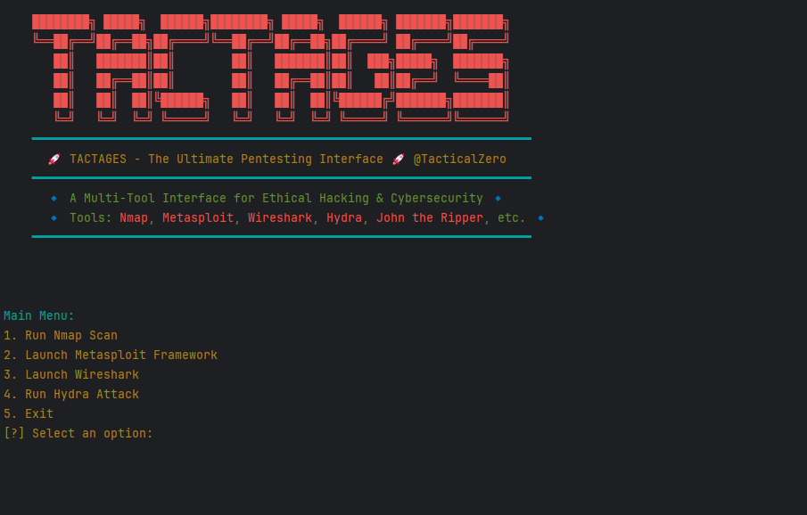

# 🚀 TACTAGES: TacticalZero Multi-Tool Interface

[](https://github.com/RohanCyberOps/tactages/stargazers) [](https://github.com/RohanCyberOps/tactages/network/members) [](LICENSE)

**TACTAGES** is a powerful, terminal-based multi-tool interface designed for ethical hacking, penetration testing, and cybersecurity analysis. It integrates popular tools like **Nmap**, **Metasploit Framework**, **Wireshark**, **Hydra**, and more into a single, user-friendly interface. Whether you're a cybersecurity professional or a hobbyist, TACTAGES simplifies your workflow and enhances productivity.

---

## ✨ Features

✅ **Integrated Tools**: Access multiple cybersecurity tools from a single interface.  
✅ **User-Friendly Menu**: Intuitive terminal menu for easy navigation.  
✅ **Customizable**: Easily add or remove tools based on your needs.  
✅ **Cross-Platform**: Works on Windows, Linux, and macOS (with required dependencies).  
✅ **Colored Output**: Enhanced terminal experience with colored text and banners.  

---

## 🛠️ Tools Included

| Tool                 | Purpose                                      |
|----------------------|----------------------------------------------|
| **Nmap**            | Network scanning and enumeration             |
| **Metasploit**      | Exploitation and post-exploitation           |
| **Wireshark**       | Packet analysis and network monitoring       |
| **Hydra**           | Password cracking and brute-force attacks    |
| **John the Ripper** | Password cracking (coming soon)              |
| **More Tools**      | Easily extendable to include additional tools |

---

## ⚡ Installation

### Prerequisites
- Python 3.x
- Required tools installed on your system:
  - Nmap
  - Metasploit Framework
  - Wireshark
  - Hydra

### Steps
```bash
# Clone the repository
git clone https://github.com/RohanCyberOps/tactages.git
cd tactages

# Install dependencies
pip install colorama

# Run the script
python tz.py
```

---

## 🖥️ Usage

### Launch the Script
```bash
python tz.py
```

### Main Menu
```bash
████████╗ █████╗  ██████╗████████╗ █████╗  ██████╗ ███████╗███████╗
╚══██╔══╝██╔══██╗██╔════╝╚══██╔══╝██╔══██╗██╔════╝ ██╔════╝██╔════╝
   ██║   ███████║██║        ██║   ███████║██║  ███╗█████╗  ███████╗
   ██║   ██╔══██║██║        ██║   ██╔══██║██║   ██║██╔══╝  ╚════██║
   ██║   ██║  ██║╚██████╗   ██║   ██║  ██║╚██████╔╝███████╗███████║
   ╚═╝   ╚═╝  ╚═╝ ╚═════╝   ╚═╝   ╚═╝  ╚═╝ ╚═════╝ ╚══════╝╚══════╝
━━━━━━━━━━━━━━━━━━━━━━━━━━━━━━━━━━━━━━━━━━━━━━━━━━━━━━━━━━━━━━━━━━━━━━
  🚀 TACTAGES - The Ultimate Pentesting Interface 🚀 @TacticalZero
━━━━━━━━━━━━━━━━━━━━━━━━━━━━━━━━━━━━━━━━━━━━━━━━━━━━━━━━━━━━━━━━━━━━━━
  🔹 A Multi-Tool Interface for Ethical Hacking & Cybersecurity 🔹
  🔹 Tools: Nmap, Metasploit, Wireshark, Hydra, John the Ripper, etc. 🔹
━━━━━━━━━━━━━━━━━━━━━━━━━━━━━━━━━━━━━━━━━━━━━━━━━━━━━━━━━━━━━━━━━━━━━━

Main Menu:
1. Run Nmap Scan
2. Launch Metasploit Framework
3. Launch Wireshark
4. Run Hydra Attack
5. Exit
[?] Select an option:
```

---

## 🔧 Adding New Tools

To add a new tool:
1. Create a new function in the script (e.g., `run_sqlmap()`).
2. Add the tool to the main menu.
3. Call the function when the user selects the option.

Example:
```python
import subprocess
from colorama import Fore

def run_sqlmap():
    target = input(f"{Fore.YELLOW}[?] Enter the target URL: ")
    command = f"sqlmap -u {target} --batch"
    print(f"{Fore.BLUE}[*] Running sqlmap on {target}...")
    subprocess.run(command, shell=True)
    print(f"{Fore.GREEN}[+] sqlmap scan completed!")
```

Update the menu:
```python
print(f"{Fore.YELLOW}6. Run sqlmap Scan")
elif choice == "6":
    run_sqlmap()
```

---

## 🤝 Contributing

Contributions are welcome! If you'd like to add a new tool, improve the interface, or fix a bug, please follow these steps:
1. **Fork the repository**.
2. **Create a new branch** (`git checkout -b feature/YourFeatureName`).
3. **Commit your changes** (`git commit -m 'Add some feature'`).
4. **Push to the branch** (`git push origin feature/YourFeatureName`).
5. **Open a pull request**.

---

## 📜 License

This project is licensed under the **MIT License**. See the [LICENSE](LICENSE) file for details.

---

## ⚠️ Disclaimer

This tool is intended for **ethical hacking** and **educational purposes only**. Do not use it for illegal activities. The developers are not responsible for any misuse of this tool.

---

## 💬 Support

If you encounter any issues or have suggestions, please open an issue on the [GitHub repository](https://github.com/RohanCyberOps/tactages/issues).

---

### **Happy Hacking!** 🚀

